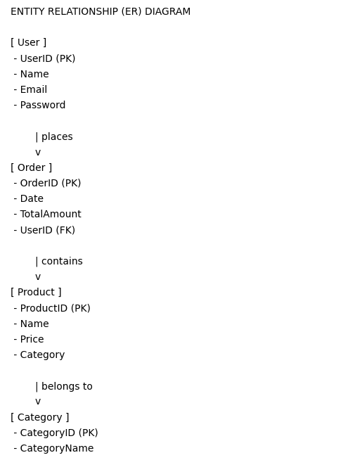

# 🛒 QuickKart – Full Stack E-commerce Web Application (Angular + .NET Core)

QuickKart is a **full-stack E-commerce web application** built using **Angular (Frontend)** and **ASP.NET Core (Backend)** with a clean layered architecture.

It simulates a real-world online shopping platform where users can browse products, search items and view offers.

---

## 📸 Application Preview


> 💡 This is the final running output of the application.

---

## 🚀 Features

* 🛍️ Product browsing with categories
* 🔍 Search functionality
* 🎯 Attractive Offers & banners display
* 🛒 Add to cart functionality
* 📦 Product display cards
* 🔐 Logout functionality
* ⚡ Fast and Responsive UI using Angular
* 🔄 Backend API integration

---

## 🧠 How This Project Works

This project is built using a **3-tier layered architecture**, ensuring scalability and maintainability.

### 🔹 Flow:

1. User interacts with **Angular Frontend**
2. Requests are sent to **ASP.NET Core Web API**
3. API processes logic via **Business Layer** and Data is fetched/stored using **Data Access Layer**

---

## 📁 Project Structure

```
QuickKart E-commerce Project/

├── QuickKart (Frontend)
│   → Angular Application

├── QuickKart (Backend)
│   ├── QuickKart-WebService → ASP.NET Core Web API
│   ├── QuickKart-BusinessLayer → Business Logic
│   └── QuickKart-DataAccessLayer → Data Handling
```

---


## 📊 System Diagrams

### 🏗️ 1. Architecture Diagram

```
        ┌──────────────────────┐
        │   Angular Frontend   │
        │  (User Interface)    │
        └─────────┬────────────┘
                  │ HTTP Requests
                  ▼
        ┌──────────────────────┐
        │ ASP.NET Core Web API │
        │   (Controller Layer) │
        └─────────┬────────────┘
                  │ Calls
                  ▼
        ┌──────────────────────┐
        │   Business Layer     │
        │ (Logic Processing)   │
        └─────────┬────────────┘
                  │ Access
                  ▼
        ┌──────────────────────┐
        │ Data Access Layer    │
        │   (Database Calls)   │
        └──────────────────────┘
```

---

### 🔹 2. Data Flow Diagram (DFD)

```
User → Frontend (Angular)
      ↓
Search / Click / Add to Cart
      ↓
Backend API (ASP.NET Core)
      ↓
Business Logic Processing
      ↓
Database (via Data Access Layer)
      ↓
Response Sent Back to UI
```

---

### 🔹 3. Use Case Diagram

```
        ┌─────────────┐
        │    User     │
        └─────┬───────┘
              │
 ┌────────────┼────────────┐
 │            │            │
 ▼            ▼            ▼
Browse     Search      Add to Cart
Products   Products     Products
 │                          │
 ▼                          ▼
View Offers             Checkout (Future)
```

---

### 🔹 4. Sequence Diagram (Basic Flow)

```
User → Frontend → API → Business Layer → Data Layer → Database
  ↑                                                       ↓
  └────────────── Response (Products Data) ───────────────┘
```

---

### 🔹 5. Component Diagram

```
[ Angular UI ]
      │
      ▼
[ Web API Controller ]
      │
      ▼
[ Business Services ]
      │
      ▼
[ Repository / DAL ]
      │
      ▼
[ Database ]
```

---

## 🗄️ Entity Relationship Diagram (ER Diagram)



---

## 🛠️ Technologies Used

### 🎨 Frontend

* Angular (Azure Static Web App)
* TypeScript
* HTML
* CSS

### ⚙️ Backend

* ASP.NET Core (Azure App Service)
* C#
* Web API (Azure Function App)

### 🧰 Tools

* Microsoft Azure (https://portal.azure.com)
* Azure DevOps (https://dev.azure.com)
* Visual Studio
* VS Code
* Node.js
* GitHub

---

## ⚙️ How to Run (Installation & Setup)

### 🔹 Clone Repository

```bash
git clone https://github.com/your-username/quickkart-ecommerce.git
cd quickkart-ecommerce
```

---

### 🔹Run Backend

```bash
cd "QuickKart (Backend)/QuickKartWebService"
dotnet restore
dotnet run
```

📍Backend will run on:
https://localhost:5001

---

### 🔹Run Frontend

```bash
cd "QuickKart (Frontend)"
npm install
ng serve
```

📍Frontend will run on:
http://localhost:4200

---

## 🔗 Note

Make sure backend is running before starting frontend.

---

🔗 API Communication

* Angular communicates with backend via REST APIs
* Ensure backend runs before frontend

---

🌟 Key Highlights

* Clean UI with product banners and cards
* Real-time search feature
* Modular backend design
* Beginner-friendly full-stack project
* Industry-style architecture

---

## 🚧 Future Improvements

- 💳 Payment Integration
- 📦 Order Tracking
- ⭐ Ratings & Reviews
- 📱 Mobile Optimization

---

🤝 Contributing

 Contributions are welcome! Feel free to fork this repo and submit pull requests.

---

📄 License

🔹 This project is for educational purposes.

---

## 👨‍💻 Author

**[Karthik N U](https://github.com/karthiknu)**

 **Contact Me:**
-  karthiknu01@gmail.com
- <a href="https://linkedin.com/in/karthik-n-u" target="blank"></a>
---

## ⭐ Support

If you like this project, give it a ⭐ on GitHub!

